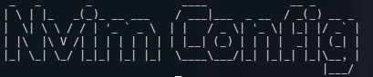

# Nikolai's Nvim Configuration



## Motovation

As a first time edeavor, this configuration is fairly simple and it is meant
to be that way.

I liked NeoVim for the simplicity, but wanted a few extra "addons" to improve
my quality of life (such as tag completion). This process also helped me
learn about how defining shortcuts for vim/nvim work and the power of setting
up various buffers to switch between files. Another feature that was super
helpful was the TAB completion of snipets/file names/paths.

This will continue to be updated as I shift my workflow and find what works
best for my development workflow.

## Prerequisites

Install NeoVim:

- Ubuntu
  ```bash
  sudo apt install neovim
  ```

Install Node Package Manager

```sh
sudo apt install npm
```

Install Pip

```sh
sudo apt install python3-pip
```

Install Python & Node support:

```sh
 pip install pynvim
```

```sh
  npm i -g neovim
```

Install GIT Version Control:

```sh
sudo apt install git
```

Install cURL:

```sh
sudo apt install curl
```

Install VimPlug:

```bash
curl -fLo ~/.local/share/nvim/site/autoload/plug.vim --create-dirs https://raw.githubusercontent.com/junegunn/vim-plug/master/plug.vim
```

Install Clang:

```bash
sudo apt install clang
```

NOTE: You may need to run this command with `sudo`

## Setting up the Config

Now that we have some of the needed tools for this config, which will also be
useful for development purposes, we can clone the repo.

Inside the `~/.config/` directory, run the command:

```sh
mkdir nvim
```

Now run:

```bash
git clone https://github.com/OkelleyDevelopment/Nvim-Configs.git
```

Then:

```bash
mv ~/.config/Nvim-Configs/* ~/.config/nvim/
```

Ensure the `.git` folder moved over too and you will have the needed assests.

## Enable the PlugIns

Inside the `/.config/nvim/` directory, open the file `./vim-plug/plugins.vim` and then run the command:

```vim
:PlugInstall
```

Once done, this will allow the plugins to begin working on reload. A few require coc installs and will be listsed below.

### CocInstall

Run the command inside Neovim:

```
:CocInstall
```

followed by any/all the following

- coc-yaml
- coc-tsserver
- coc-tslint
- coc-sh
- coc-rls
- coc-python
- coc-java
- coc-html
- coc-explorer
- coc-css
- coc-clnagd
- coc-prettier
- coc-snippets

NOTE: If you wish to see what CoC extensions exist run this:

```
:CocInstall coc-marketplace
```

then run:

```
:CocList marketplace
```

## Notable Syntax Support

With the above CocInstalls and plugins installed, you will have:

- Highlighted Text
- CSS preview
- Tag Completion
- Python Syntax Checking
- JavaScript/TypeScript checking
- Java syntax checking
- Auto-pairing of braces/parenthesis
- Auto URL highlighter

## Organization

To help make things more organized, each "task" is in its own directory
and then sourced from that directory in the `init.vim` file.

Being able to read code/text documents is really helpful and when dealing
with HTML tag auto-closing is amazing.

## Adding Plugins

If you would like to add more plugins simply follow these steps:

1. Locate the plugins `Plug` command
2. Add it to the file in `./vim-plug/plugins.vim`
3. Save and quit
4. Make any plugin specifc configurations in `./plug-config/` and source in
   `./init.vim`
5. Then run the command `:PlugInstall`
   - Note: My file has an autoload function when opening Nvim, so
     you may not have to run that command explicitly

## Adding Themes

We all have different opinions on the _best_ theme and can be done following
the steps below.

1. Locate the `Plug` command for the theme
2. Add it to the file in `./vim-plug/plugins.vim`
3. Save and quit
4. Make any plugin specifc configurations in ` ./themes/``<name of theme>.vim ` and source in
   `./init.vim`

## Adding/Changing the Key Mappings

All the key mappings are sourced through `init.vim` and can be easily remapped
in the
`./keys/`
directory.

For help learning how to map keys check out this [article](https://medium.com/vim-drops/understand-vim-mappings-and-create-your-own-shortcuts-f52ee4a6b8ed).

## Custom Snippets

This is easily one of the coolest parts of this setup. Coc-snippets allows the user
to have access to a wide range of code snippets (common ops in the langs).

Check [this](https://open.spotify.com/track/100lHmeZbp3OvinYgotmVc?si=trfxU5PdR9Ctps8t1QZ3ow) link to learn more.

If you want to create your own snippets, add a file in the `./snips/` directory
with the following naming scheme:

```
<language name goes here>.snippets
```

Then adding the snippet is a matter of following the instructions on the coc-snippets
github.

## TODO

- More Language Support
- Custom theme with similar color scheme to Nord
- Spell Checker
- Shell script to install the needed dependancies
