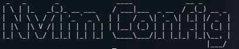

# Nikolai's Nvim Configuration



## Motivation

As a first time edeavor, this configuration is fairly simple and it is meant
to be that way while still offering some gnarly features. I liked NeoVim for
the simplicity, but wanted a few "addons" to improve my quality of life
(such as HTML tag completion).

This process also helped me learn about how defining shortcuts for vim/nvim work
and the power of setting up various buffers to switch between files. Another
feature that was super helpful was the `TAB` completion of snipets/file names and paths.

NOTE: This will continue to be evolve as I shift my workflow and fine tune each individual
aspect of this development workflow.

## Prerequisites

View the complete listing [here](./util/external_readmes/prereq.md)

## Setting up the Config

Now that we have some of the needed tools for this config, which will also be
useful for development purposes, we can clone the repo.

Follow this initial [setup](./util/external_readmes/setup.md) file for instructions on directory layout.

## Enable the PlugIns

Follow [coc_setup.md](./util/external_readmes/coc_setup.md) for the instructions on setting up
the plugins.

## Notable Syntax Support

With the above Plugins and coc services installed, you will have:

- Highlighted Text
- CSS preview
- Tag Completion
- Python Syntax Checking
- JavaScript/TypeScript checking
- Java syntax checking
- Auto-pairing of braces/parenthesis
- Auto URL highlighter

## Organization

To help make things more organized, each "task" is in its own directory
and then sourced from that directory in the `init.vim` file.

This pattern will make adding new plugins and or configurations to existing
plugins much _easier to maintain_.

## Adding Plugins

If you would like to add more plugins simply follow the steps [here](./util/external_readmes/add_plugins.md)

## Adding Themes

We all have different opinions on the _best_ theme and can be done following
the steps [here](./util/external_readmes/add_themes.md)

## Adding/Changing the Key Mappings

Some of my key mappings might not be what you need and can easily be changed
by looking at the steps [here](./util/external_readmes/key_mapping.md)

## Custom Snippets

This is easily one of the coolest parts of this setup. Coc-snippets allows the user
to have access to a wide range of code snippets (common ops in the langs).

Check [this](https://github.com/neoclide/coc-snippets) link to learn more.

If you want to create your own snippets, add a file in the `./snips/` directory
with the following naming scheme:

```
<language name goes here>.snippets
```

Then adding the snippet is a matter of following the instructions on the coc-snippets
github.

## TODO

- Custom theme with similar color scheme to Nord
- Spell Checker
- Shell script to install the needed dependancies
