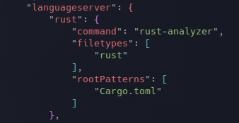

# Nikolai's Nvim Configuration


## Motovation
As a first time edeavor, this configuration is fairly simple and it is meant 
to be that way.          

I liked NeoVim for the simplicity, but wanted a few extra "addons" to improve
my quality of life (such as tag completion). This process also helped me
learn about how defining shortcuts for vim/nvim work and the power of setting
up various buffers to switch between files. Another feature that was super 
helpful was the TAB completion of snipets/file names/paths.        

This will continue to be updated as I shift my workflow and find what works 
best for my development workflow. 

## Prerequisites:

Install NeoVim:
- Ubuntu
    ```
    sudo apt install neovim
    ```
- Arch
    ```
    sudo pacman -S neovim
    ```

To install VimPlug run:
` curl -fLo ~/.local/share/nvim/site/autoload/plug.vim --create-dirs https://raw.githubusercontent.com/junegunn/vim-plug/master/plug.vim
`

## Install Python & Node support
`pip install pynvim`

`npm i -g neovim` NOTE: You may need to run this command with `sudo`

## Organization
To help make things more organized, each "task" is in its own directory
and then sourced from that directory in the `init.vim` file.       

Being able to read code/text documents is really helpful and when dealing
with HTML tag auto-closing is amazing. 

## Adding Plugins
If you would like to add more plugins simply follow these steps:
1. Locate the plugins `Plug` command 
2. Add it to the file in `./vim-plug/plugins.vim`
3. Save and quit
4. Make any plugin specifc configurations in `./plug-config/` and source in
`./init.vim`
5. Then run the command `:PlugInstall`
    - Note: My file has an autoload function when opening Nvim, so 
    you may not have to run that command explicitly


## Adding Themes
We all have different opinions on the *best* theme and can be done following
the steps below.
1. Locate the `Plug` command for the theme
2. Add it to the file in `./vim-plug/plugins.vim`
3. Save and quit
4. Make any plugin specifc configurations in `./themes/``<name of theme>.vim` and source in
`./init.vim`

## Notable Syntax Support
- Highlighted Text
- CSS preview
- Tag Completion
- Python Syntax Checking
- JavaScript/TypeScript checking
- Java syntax checking
- Auto-pairing of braces/parenthesis
- Auto URL highlighter

## Language Servers
CoC does not support all languages in their extensions, so installing
some secondary language servers may be needed. I recommend installing and
adding them your `coc-settings.json` file, as suggested by [Chris](https://www.chrisatmachine.com/).

Example:
- Rust



## TODO
- More Language Support
- Custom theme with similar color scheme to Nord
- Snippets
- Spell Checker
- Shell script to install the needed dependancies
